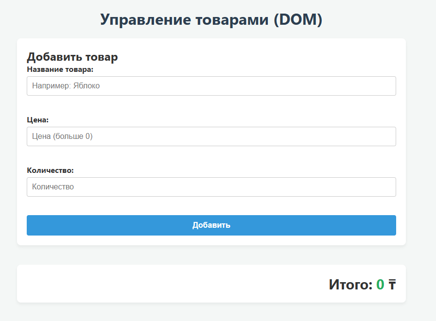
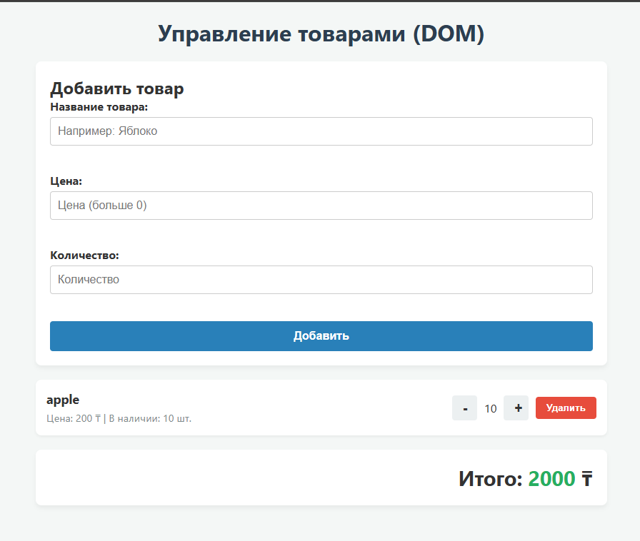
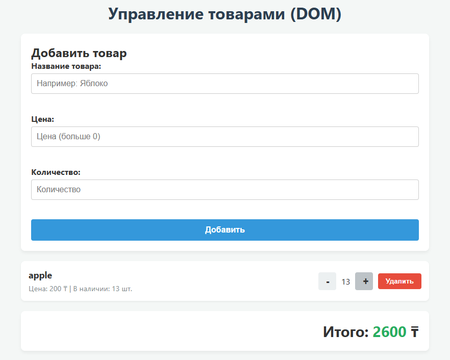

# Lab 5: DOM, Events and Forms
**Author:** Meirbek Spabekov

## Как запустить
Просто скачайте репозиторий и откройте файл `index.html` в любом браузере. Локальный сервер или Node.js для запуска не требуются, так как вся логика работает напрямую в DOM.

## Скриншот

## Работа с событиями и Делегирование
В проекте обрабатываются два основных события. 
1. `submit` на форме `addForm`: я отменяю стандартное поведение (`e.preventDefault()`) и провожу валидацию инпутов. Ошибки выводятся не через `alert`, а прямо в DOM-элементы `` под каждым полем.
2. `click` на контейнере `listContainer`: здесь я применил **делегирование событий**. Вместо того чтобы вешать слушатель на каждую кнопку "Удалить", "+" или "-", я повесил один обработчик на весь список. Когда происходит клик, скрипт проверяет наличие классов (`action-remove`, `action-increase`, `action-decrease`) у `e.target` и выполняет соответствующий метод в классе `Store`. Это оптимизирует память и позволяет кнопкам корректно работать даже после перерисовки DOM без переназначения слушателей.

## Использование ИИ
При выполнении задания я обращался к ИИ Google Gemini для консультации по правильной организации паттерна делегирования событий.